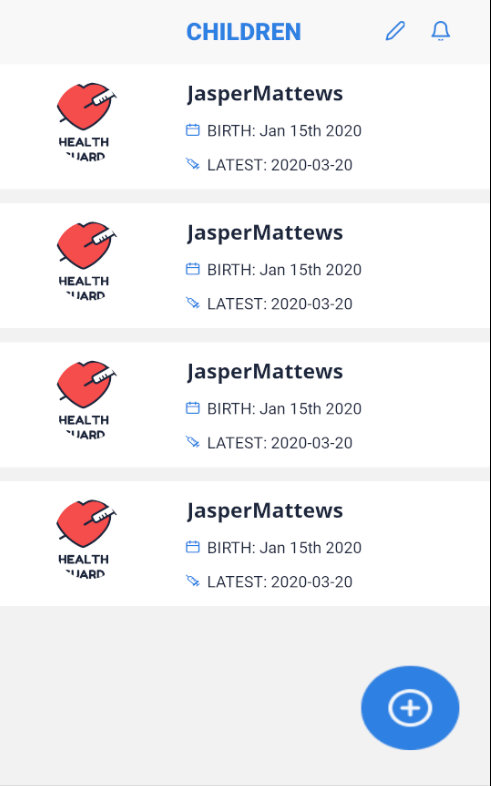
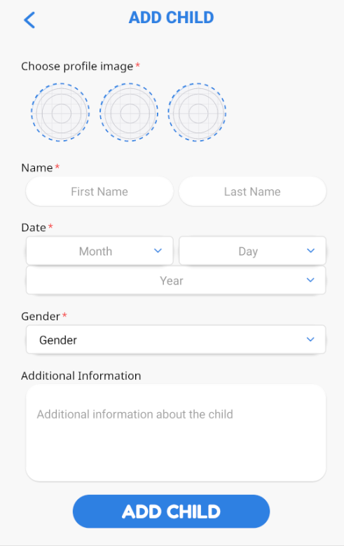
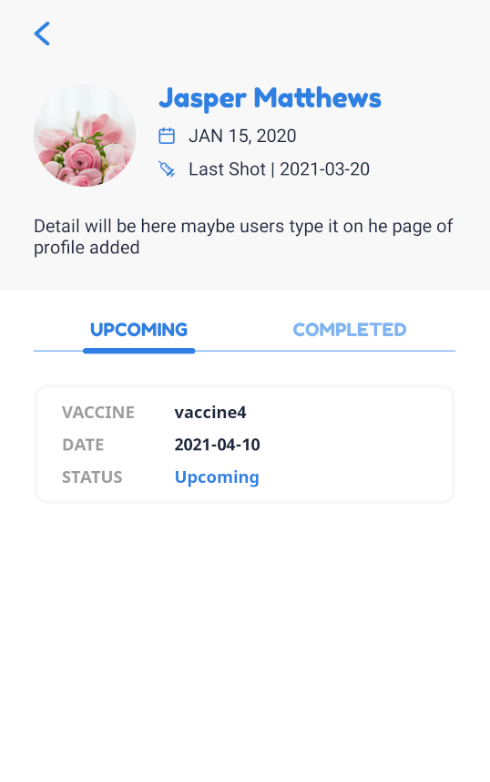
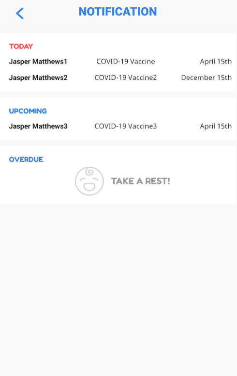

    
# HealthGuard

HealthGuard provides parents with an easy-to-use interface to manage and track their children's vaccination history.


[](https://choosealicense.com/licenses/mit/)


[](https://choosealicense.com/licenses/mit/)


  
## Authors

- [@ajlomagno](https://www.github.com/ajlomagno)
- [@hyunjiLeeTech](https://www.github.com/hyunjiLeeTech)
- [@ElisaNgLi](https://www.github.com/ElisaNgLi)
- [@HyoukSunKwon](https://www.github.com/HyoukSunKwon)

  
## Features

- English/Spanish/Korean localization
- Manage multiple children's vaccine history
- Schedule vaccination appointments
- Notifications for upcoming vaccinations

  
## Tech Stack

**Frontend:** ``React-Native, Boostrap``


  
## Deploying & Running

#### Requirements

- [Expo](https://expo.io/)

- Android device with [Expo Go App](https://expo.io/client) OR

- Android Emulator running on the same computer
 

To deploy and run this project:

```bash
  git clone https://github.com/1B2K/HealthGuard.git

  npm install

  npm start
```

  
## Screenshots






  
